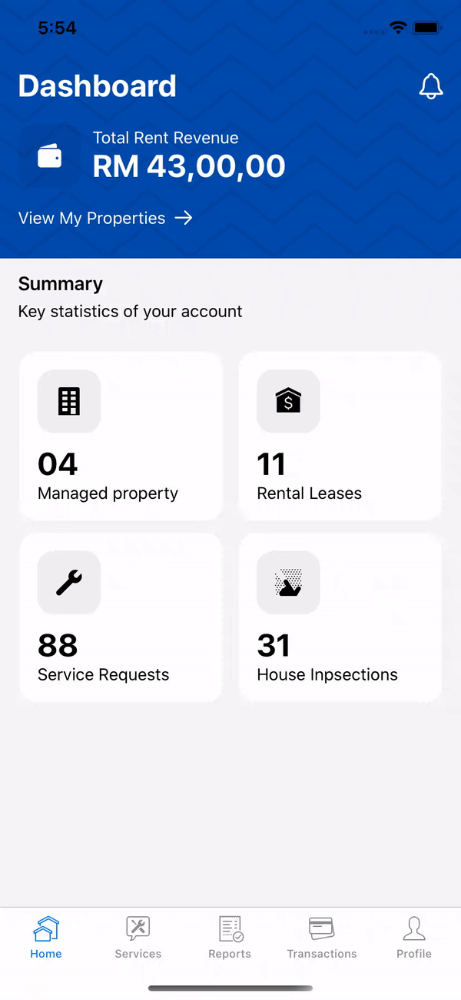

 # Prory

[](https://github.com/Edwin97/DoorRush/blob/master/LICENSE)
[](https://swift.org)
[](https://twitter.com/edwinchan97)

Prory is a property management solution that provides all the resources you need to manage your rental property, at your fingertips. The simple yet powerful design of the mobile app makes it easy for the house-owners to handle the property related issues at any point of time.

<h3>
<kbd></kbd>
</h3>

# Installation
## CocoaPods
To install the dependencies, simply run the following line:

```ruby
pod install
```

## Compatibility

This project is written in Swift 5.0 and requires Xcode 11.5 or newer to build and run.

Prory is compatible with iOS 13.5+.
